# Imágenes — V1

Miniaturas enlazadas a la imagen a tamaño completo. Haz clic para ver el original.

## Block01

<a href="block01/block01.jpg">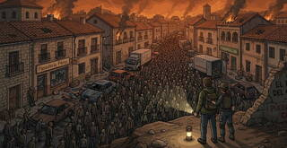</a>

### Chapter01

<a href="block01/chapter01/ubiquitous-language.jpg">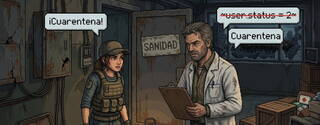</a>

### Chapter02

<a href="block01/chapter02/bounded-contexts.jpg">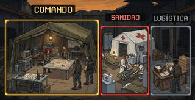</a>
<a href="block01/chapter02/subdomain-vs-context.jpg">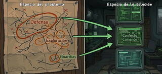</a>
<a href="block01/chapter02/subdomains.jpg">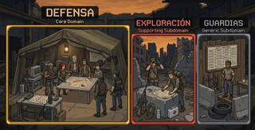</a>

### Chapter03

<a href="block01/chapter03/anti-corruption-layer.jpg">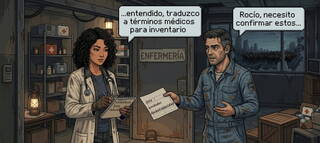</a>

<a href="block01/chapter03/context-map.jpg">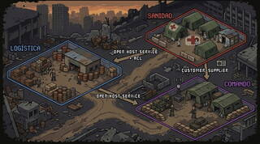</a>

<a href="block01/chapter03/open-host-service.jpg">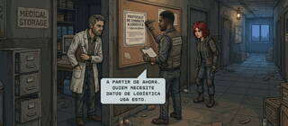</a>

## Block02

<a href="block02/block02.jpg">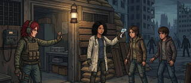</a>

### Chapter04

<a href="block02/chapter04/entities-value-objects.jpg">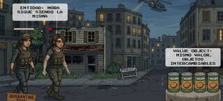</a>

### Chapter05

<a href="block02/chapter05/aggregate-map.jpg">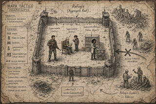</a>
<a href="block02/chapter05/aggregates.jpg">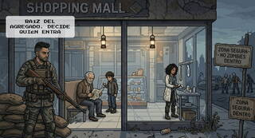</a>
<a href="block02/chapter05/without-aggregate.jpg">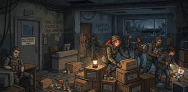</a>

### Chapter06

<a href="block02/chapter06/rocio-assesses-infection.jpg">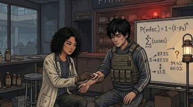</a>
<a href="block02/chapter06/transfer-service.jpg">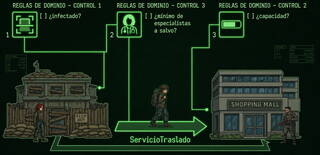</a>

## Block03

### Chapter08

<a href="block03/chapter08/octavia-coordinates-admission.jpg">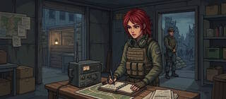</a>

## Block04

### Chapter11

<a href="block04/chapter11/saga-evacuation-map.jpg">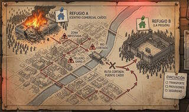</a>

### Chapter13

<a href="block04/chapter13/ddd-tests.jpg">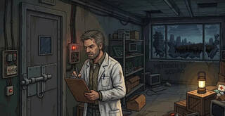</a>
